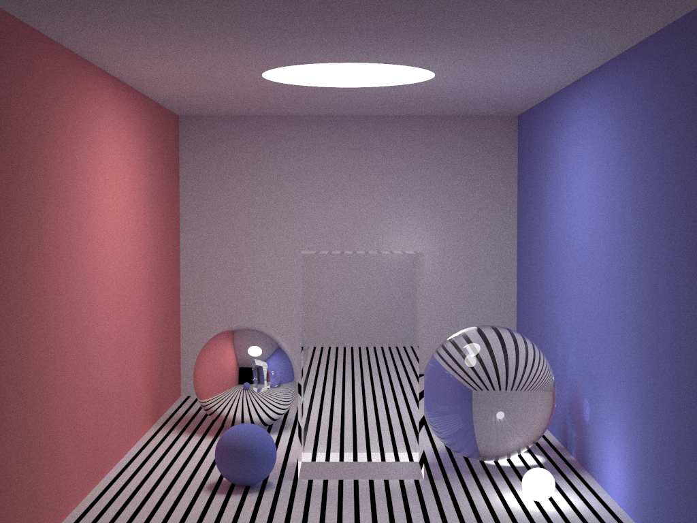

# Path Tracer

A simple Ray Tracing render. derived from small PT.

## Usage

```shell
compile: g++ -I [path to object.h plane.h]-O3 -fopenmp render.cpp -o render
run: time ./render 5000
```

## Result

rendered image: 1024 * 768 5000 spp



## Effects

- diffuse - Matte, Light
- refraction - Glass
- specular - Mirror

Matte: the blue sphere

Diffuse: left, right, top, bottom, front, back walls

lights: top light, sphere

Glass: sphere, cube

Metal: sphere

super sampling, soft shadow

for each pixel, perform a 2x2 sub pixels and tent filter.


